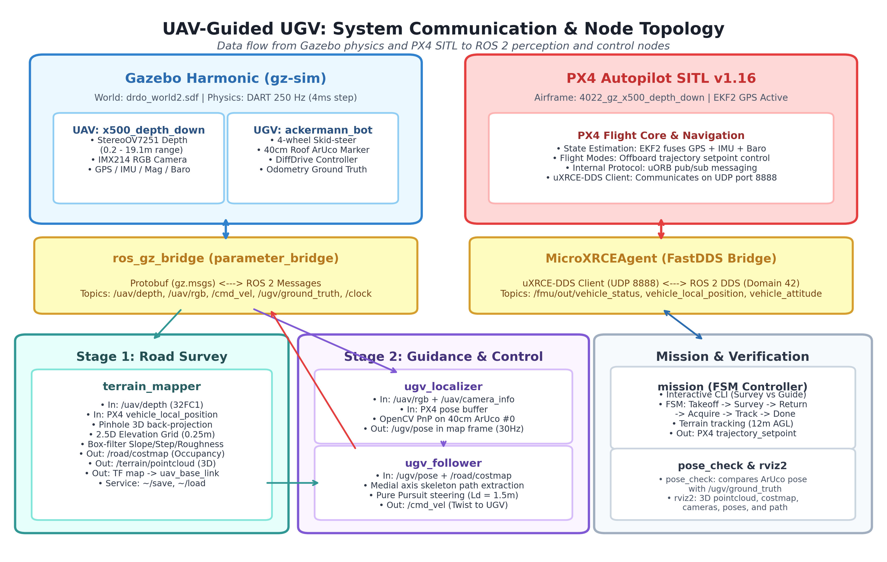
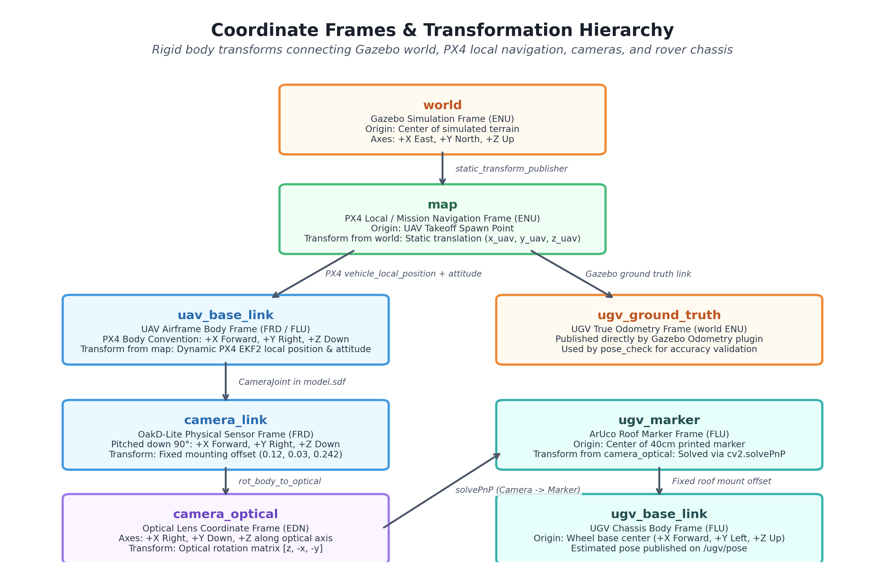

# System Overview & Architecture

## 1. Mission Concept & Problem Statement

The **DRDO UAV-Guided UGV Navigation System** solves the challenge of autonomous ground vehicle traversal across unknown, unstructured, and GPS-denied rough mountain terrain. 

Ground vehicles (UGVs) navigating complex off-road environments frequently suffer from:
1. **Severe Sensor Occlusion:** Ground-level LiDAR and cameras cannot see over crests, around hairpin switchbacks, or past boulders.
2. **Kinematic Hazards:** Steep gradients, drop-offs, and rocky steps exceed vehicle rollover and suspension limits.
3. **Localization Drift:** Wheel slippage and GPS multipath in mountainous terrain quickly corrupt dead reckoning.

To solve this, our system employs an **aerial-ground collaborative architecture**:
- A **Quadrotor UAV** (`x500_depth_down`) equipped with a downward-facing **OakD-Lite** camera module flies ahead of the ground vehicle.
- The UAV performs a low-altitude aerial survey, generating a 2.5-D geometric elevation model and a traversable road costmap.
- The UAV then returns to the UGV, acts as an overhead visual satellite tracking the UGV's roof-mounted ArUco marker with centimeter accuracy, and guides the UGV along the mapped road centerline using a custom **Regulated Pure Pursuit** controller.

---

## 2. End-to-End Mission Workflow

```
+-------------------+      +-------------------+      +-------------------+
|      Phase 1      | ---> |      Phase 2      | ---> |      Phase 3      |
|   Aerial Survey   |      | Return & Rendezvous|     | Guidance & Pursuit|
+-------------------+      +-------------------+      +-------------------+
| - Autonomous or   |      | - UAV returns to  |      | - UAV holds 10m   |
|   manual flight   |      |   UGV spawn pose  |        station overhead  |
| - 2.5D elevation  |      | - Detects roof    |      | - ArUco tracks UGV|
|   accumulation    |      |   ArUco marker    |      | - Pure Pursuit    |
| - Geometric risk  |      | - Syncs costmap   |        steers UGV along  |
|   classification  |      |   and centerline  |        costmap center    |
| - Road costmap    |      |                   |      | - Halts at goal   |
+-------------------+      +-------------------+      +-------------------+
```

### Phase 1: Aerial Road Survey & Costmap Generation
- The UAV takes off to a survey altitude of **$12\text{ m}$ Above Ground Level (AGL)**.
- It translates along the expected road corridor (either autonomously via `explore.py` frontier tracking or manually via keyboard teleoperation).
- The downward-facing depth camera streams $640 \times 480$ metric depth frames at $30\text{ Hz}$.
- [`terrain_mapper_node`](../src/road_survey/road_survey/terrain_mapper_node.py) throttles integration to $5\text{ Hz}$, unprojects depth frames into 3D world coordinates using PX4 local position and attitude, and accumulates elevations into a $400 \times 400\text{ m}$ grid with $0.25\text{ m}$ cell resolution.
- Every $2\text{ seconds}$, a plane-fitting classification algorithm evaluates terrain slope, step hazards, and surface roughness, producing a binary road mask and a 2D Euclidean Distance Transform costmap.
- The survey can be concluded at the road terminus or stopped early by the operator; the system saves `road_map.npz`, `road_map.yaml`, and `road_map.pgm`.

### Phase 2: Autonomous Return & Station-Keeping
- The UAV enters the `RETURN_TO_UGV` state, flying back to the UGV's known starting coordinates at $3.0\text{ m/s}$.
- Upon reaching the vicinity of the UGV, the UAV transitions to `TRACK_UGV` at **$10\text{ m}$ AGL**.
- The onboard nadir RGB camera scans for the UGV's roof-mounted ArUco marker (`DICT_4X4_50`, ID 0).
- Once detected, the UAV centers itself directly above the marker, providing an unobstructed overhead bird's-eye view.

### Phase 3: Overhead Visual Localization & Regulated Pure Pursuit Guidance
- **Visual Localization:** [`ugv_localizer_node`](../src/guidance/guidance/localizer_node.py) processes $1920 \times 1080$ RGB frames at $15\text{ Hz}$, detects the marker corners, solves the Perspective-n-Point (PnP) problem, and transforms the marker pose into the world `map` frame (`/ugv/pose`).
- **Centerline Extraction:** [`follower_node`](../src/guidance/guidance/follower_node.py) extracts the medial axis skeleton of the traversable road costmap, parameterizing the path as an arc-length spline.
- **Pure Pursuit Steering:** Using our custom, zero-dependency Regulated Pure Pursuit algorithm, the node computes target lookahead points ($L_d = 1.5\text{ m}$), calculates steering curvature, regulates velocity based on turning radius, and issues velocity commands (`/cmd_vel`) to the Ackermann UGV.
- **Coordinated Formation:** As the UGV navigates the road, the UAV follows overhead, dynamically updating its position setpoint to keep the UGV centered in its optical field of view.

---

## 3. High-Level System Architecture & Topology

Below is the complete hardware and software communication topology linking Gazebo Harmonic, PX4 Autopilot, ROS 2 Humble, and the user interfaces.



### Key Architectural Boundaries

1. **Simulation Environment (Gazebo Harmonic / gz-sim):**
   - Simulates physical vehicle dynamics (quadrotor aerodynamics, Ackermann 4-wheel physics, friction, contact).
   - Renders 3D terrain meshes (`terrain_raster.dae`) and textures from satellite orthoimagery.
   - Provides sensor simulation for the downward OakD-Lite camera (IMX214 RGB camera and StereoOV7251 depth camera) and ground-truth odometry.

2. **Autopilot State Estimation & Control (PX4 SITL):**
   - Runs the official PX4 Autopilot firmware compiled for POSIX SITL.
   - Executes the 24-state Extended Kalman Filter (EKF2) fusing simulated IMU, barometer, GPS, and magnetometer.
   - Connects to ROS 2 through **Micro-XRCE-DDS-Agent** over UDP port `8888`.

3. **ROS 2 Communication Layer:**
   - **`ros_gz_bridge`:** Bridges camera images, camera info, simulation clock (`/clock`), and UGV velocity commands (`/cmd_vel`) between Gazebo and ROS 2.
   - **`px4_msgs`:** High-throughput DDS interface for subscribing to PX4 vehicle odometry and publishing offboard trajectory setpoints.
   - **ROS Domain Isolation:** Standardized on `ROS_DOMAIN_ID=42` with `ROS_LOCALHOST_ONLY=0` across all launch files and nodes.

---

## 4. Coordinate Frame Transformations & REP Standards

The system adheres strictly to **ROS REP-103** (Standard Units and Coordinate Conventions) and **REP-105** (Coordinate Frames for Mobile Platforms).



### Frame Reference Table

| Frame ID | Convention | Description |
| :--- | :--- | :--- |
| `world` | ENU ($+X$ East, $+Y$ North, $+Z$ Up) | Gazebo simulation global inertial reference frame. |
| `map` | ENU ($+X$ East, $+Y$ North, $+Z$ Up) | Local mission coordinate frame, rooted at the UAV's initial spawn point. Shifted from `world` by $(uav_x, uav_y, uav_z)$. |
| `uav_base_link` | FLU ($+X$ Forward, $+Y$ Left, $+Z$ Up) | Rigid body frame of the quadrotor. |
| `camera_link` | FLU ($+X$ Forward, $+Y$ Left, $+Z$ Up) | Rigid body mounting frame of the OakD-Lite camera, pitched $+90^\circ$ downward. |
| `camera_optical_frame`| CV Optical ($+X$ Right, $+Y$ Down, $+Z$ Optical Axis)| Standard optical frame. $+Z$ points straight down toward the terrain. |
| `ugv_base_link` | FLU ($+X$ Forward, $+Y$ Left, $+Z$ Up) | Rigid chassis frame of the Ackermann ground vehicle. |
| `aruco_marker_link`| FLU ($+X$ Forward, $+Y$ Left, $+Z$ Up) | Center of the top surface of the roof-mounted ArUco marker ($Z = +0.1275\text{ m}$ above chassis). |

### PX4 NED to ROS ENU Transformation
PX4 operates natively in the **North-East-Down (NED)** aerospace convention. All PX4 topics are converted to **East-North-Up (ENU)** by [`px4.py`](../src/guidance/guidance/px4.py) and [`frames.py`](../src/road_survey/road_survey/frames.py):

$$\begin{bmatrix} x_{\text{enu}} \\ y_{\text{enu}} \\ z_{\text{enu}} \end{bmatrix} = \begin{bmatrix} 0 & 1 & 0 \\ 1 & 0 & 0 \\ 0 & 0 & -1 \end{bmatrix} \begin{bmatrix} x_{\text{ned}} \\ y_{\text{ned}} \\ z_{\text{ned}} \end{bmatrix}$$

Attitude quaternions $(w, x, y, z)$ are similarly transformed to represent rotations from body FLU to map ENU.
