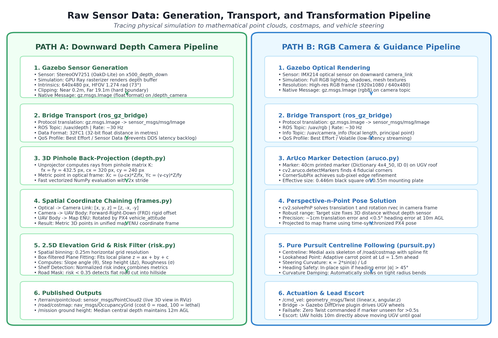

# Sensor Stack & Depth Processing Pipeline

## 1. Dual Camera Hardware vs. Simulation Architecture

### Real Hardware: Luxonis Oak-D Lite
In physical robotics, the **Luxonis Oak-D Lite** is a single hardware module containing three image sensors on a unified printed circuit board:
- **RGB Sensor (Center):** Sony IMX214 ($1920 \times 1080$ resolution, rolling shutter, color).
- **Stereo Pair (Left & Right):** Two OmniVision OV7251 grayscale sensors ($640 \times 480$ resolution, global shutter) separated by a fixed **$75\text{ mm}$ physical baseline**.
- **Onboard Vision Processing Unit (VPU):** An Intel Movidius Myriad X chip computes semi-global matching stereo disparity on-chip, outputting aligned color and metric depth buffers.

```
                  +-----------------------------------+
                  |         Oak-D Lite Enclosure      |
                  |                                   |
                  |  [OV7251]       [IMX214]  [OV7251]|
                  |  Left IR          RGB     Right IR|
                  |  camera          camera    camera |
                  +-----------------------------------+
```

### Simulation Model in Gazebo SDF & ROS URDF
In simulation, modeling two independent cameras and computing software stereo disparity is computationally prohibitive and noisy. Gazebo Harmonic provides an efficient, physically accurate alternative:
- The entire camera enclosure is represented by a single rigid link: `camera_link`.
- Under this single link, **two sensors are co-located at the optical origin**:
  1. `<sensor name="IMX214" type="camera">`: Publishes color RGB images.
  2. `<sensor name="StereoOV7251" type="depth_camera">`: Uses Gazebo's GPU ray-caster to directly generate an analytical metric depth buffer.

### Physical Mounting & Nadir Pitch
In [`x500_depth_down/model.sdf`](../src/drdo_gz_worlds/models/x500_depth_down/model.sdf) and [`x500_depth_down.urdf`](../src/drdo_gz_worlds/urdf/x500_depth_down.urdf):
- **Translation:** $X = +0.12\text{ m}$, $Y = +0.03\text{ m}$, $Z = +0.242\text{ m}$ relative to the drone's `base_link`.
- **Orientation:** $\text{Roll} = 0.0$, $\text{Pitch} = +1.570796\text{ rad}$ ($+90^\circ$), $\text{Yaw} = 0.0$.
- Because drone body axes are FLU ($+X$ forward), pitching $+90^\circ$ points the optical axis **vertically downward (nadir)** toward the ground.

---

## 2. Gazebo Sensor Data Flow & Bridge Architecture

Below is the complete sensor data pipeline, illustrating how raw simulation buffers travel from Gazebo Harmonic into ROS 2 and are processed into costmaps and 3D point clouds.



### Topic Bridging Configuration ([`uav_bridge.launch.py`](../src/drdo_gz_worlds/launch/uav_bridge.launch.py))
The `ros_gz_bridge` process forwards camera streams across the simulation boundary:

| Sensor | Gazebo Harmonic Topic | ROS 2 Bridged Topic | ROS 2 Message Type |
| :--- | :--- | :--- | :--- |
| **RGB Camera** | `/world/.../sensor/IMX214/image` | `/uav/rgb` | `sensor_msgs/msg/Image` (`bgr8`, $1920 \times 1080$ @ $30\text{ Hz}$) |
| **RGB Info** | `/world/.../sensor/IMX214/camera_info` | `/uav/camera_info` | `sensor_msgs/msg/CameraInfo` |
| **Depth Camera** | `/depth_camera` | `/uav/depth` | `sensor_msgs/msg/Image` (`32FC1`, $640 \times 480$ @ $30\text{ Hz}$) |
| **Depth Info** | `/camera_info` | `/uav/depth_camera_info` | `sensor_msgs/msg/CameraInfo` |
| **Sim Clock** | `/world/.../clock` | `/clock` | `rosgraph_msgs/msg/Clock` |

---

## 3. Depth Camera Encoding and Decoding

A common source of confusion when first visualizing `/uav/depth` in standard tools (RViz default image viewer, web browsers, or OpenCV `cv2.imshow()`) is that the image appears completely solid black.

### The Physics and Encoding (`32FC1`)
1. **Metric Float Encoding:** Unlike RGB images which use 8-bit unsigned integers (`uint8`, values 0–255), depth cameras encode depth as **single-channel 32-bit floating point numbers (`32FC1`)**.
2. **True Distance in Meters:** Each pixel directly stores the physical metric distance from the camera optical plane to the terrain surface. 
   - A ground pixel at $12.0\text{ m}$ below the drone has a numeric float value of `12.0`.
   - A boulder at $10.5\text{ m}$ below the drone has a numeric float value of `10.5`.
3. **The Integer Display Range Problem:** Standard image renderers assume pixel intensities span $0$ (pure black) to $255$ (pure white). When an image viewer interprets a float value of `12.0` on a 0–255 scale, it displays an intensity of $\frac{12.0}{255} \approx 4.7\%$ brightness. To human vision, this is indistinguishable from solid black!
4. **Visualizing Correctly in RViz2:**
   - In RViz2, expand the **Image** display for `/uav/depth`.
   - Enable **Normalize Range**.
   - Set **Min Value = 0.0** and **Max Value = 20.0** (or check "Dynamic Range").
   - The terrain contours, road boundaries, and rocks immediately render with clear grayscale contrast.

---

## 4. Code-Level Depth Decoding (`road_survey/depth.py`)

In [`src/road_survey/road_survey/depth.py`](../src/road_survey/road_survey/depth.py), incoming ROS 2 `Image` messages are unpacked without copying memory:

```python
def decode_image(msg: Image, depth_min: float = 0.4, depth_max: float = 18.0) -> np.ndarray:
    """
    Decodes a 32FC1 ROS 2 Image message into a 2D float32 NumPy array.
    Replaces out-of-range, NaN, and Inf values with NaN.
    """
    # msg.data is a 1,228,800 byte buffer (640 x 480 x 4 bytes/float32)
    # view() creates a float32 array in-place without copying bytes
    raw = np.frombuffer(msg.data, dtype=np.uint8).view(np.float32)
    depth = raw.reshape((msg.height, msg.width)).copy()

    # Filter out drone landing gear reflections (< depth_min)
    # and ray-cast far-clip misses (> depth_max)
    invalid = ~np.isfinite(depth) | (depth < depth_min) | (depth > depth_max)
    depth[invalid] = np.nan
    return depth
```

---

## 5. 3D Point Cloud Reconstruction & Back-Projection

```
  Image Plane (u, v)                3D Camera Optical Frame (X_c, Y_c, Z_c)
  +--------------+                     Z_c (optical axis)
  |      *(u, v) |                    /
  |       |      |                   /  * P_c = (X_c, Y_c, Z_c)
  |       v      |                  /  /
  |      Z=depth |                 +--/--------> X_c
  +--------------+                 | /
                                   |/
                                   v Y_c
```

### Step 1: Pinhole Camera Intrinsics
From `/uav/depth_camera_info` (or horizontal FOV $\text{HFOV} = 1.274\text{ rad}$), the intrinsic matrix $K$ is:

$$K = \begin{bmatrix} f_x & 0 & c_x \\ 0 & f_y & c_y \\ 0 & 0 & 1 \end{bmatrix}$$

For $W = 640, H = 480$:
$$c_x = \frac{W}{2} = 320.0, \quad c_y = \frac{H}{2} = 240.0$$
$$f_x = f_y = \frac{W}{2 \tan(\text{HFOV} / 2)} = \frac{320.0}{\tan(0.637)} \approx 438.4\text{ px}$$

### Step 2: Back-Projection to 3D Optical Coordinates
For every valid pixel $(u, v)$ with metric depth $Z = \text{depth}[v, u]$:

$$X_c = \frac{(u - c_x) \cdot Z}{f_x}, \quad Y_c = \frac{(v - c_y) \cdot Z}{f_y}, \quad Z_c = Z$$

This generates a set of 3D point vectors $P_c = [X_c, Y_c, Z_c]^T$ in `camera_optical_frame`.

### Step 3: Rigid Transformation into World Map (ENU) Frame
To position the points in the global coordinate system, points are transformed using the drone's position and orientation:

$$P_{\text{map}} = T_{\text{map}}^{\text{body}} \cdot T_{\text{body}}^{\text{camera}} \cdot T_{\text{camera}}^{\text{optical}} \cdot P_c$$

1. **$T_{\text{camera}}^{\text{optical}}$:** Converts CV optical axes (+Z forward, +X right, +Y down) into body axes (+X forward, +Y left, +Z up).
2. **$T_{\text{body}}^{\text{camera}}$:** Fixed camera translation $(0.12, 0.03, 0.242)$ and nadir pitch $+90^\circ$.
3. **$T_{\text{map}}^{\text{body}}$:** Real-time drone position $(x, y, z)$ and attitude quaternion $(q_w, q_x, q_y, q_z)$ from PX4 SITL, converted from NED to ENU.

### Step 4: ROS 2 PointCloud2 Generation
In [`terrain_mapper_node.py`](../src/road_survey/road_survey/terrain_mapper_node.py), the transformed points are packaged into standard ROS 2 format:

```python
# Create sensor_msgs/msg/PointCloud2 with fields [x, y, z] float32
cloud_msg = pc2.create_cloud_xyz32(header, points_map.tolist())
self.pub_cloud.publish(cloud_msg)
```
This is published to `/terrain/pointcloud` and visualized in 3D in RViz2.

---

## 6. Architectural Rationale: Why Point Clouds Are Not Bridged from Gazebo

Gazebo Harmonic has the internal capability to output `/depth_camera/points` (`gz.msgs.PointCloudPacked`). However, **our architecture explicitly excludes this topic from the bridge**.

### Performance Analysis
- **Point Cloud Overhead:** A $640 \times 480$ cloud at $30\text{ Hz}$ produces $307,200 \text{ points} \times 16\text{ bytes} \times 30\text{ fps} \approx \mathbf{147.5\text{ MB/second}}$.
  - Serializing $150\text{ MB/s}$ over ROS 2 DDS introduces massive CPU consumption, network transport latency, and throttles Gazebo physics (causing the Real-Time Factor to plunge below 0.3).
- **2D Depth Image Overhead:** Transmitting the 2D depth image requires only $640 \times 480 \times 4\text{ bytes} \times 30\text{ fps} \approx \mathbf{36.8\text{ MB/second}}$ (less than 25% of the data rate).

### On-Demand Downsampling
By performing unprojection inside [`terrain_mapper_node`](../src/road_survey/road_survey/terrain_mapper_node.py):
1. Integration is throttled from $30\text{ Hz}$ to **$5\text{ Hz}$**.
2. A pixel stride of 2 is applied (sampling every 2nd row and column), reducing point count from 307,200 to ~76,800 points per frame.
3. Unprojection is skipped entirely when the drone is stationary or banking heavily ($>25^\circ$).

This ensures accurate 3D mapping with minimal computational load.
