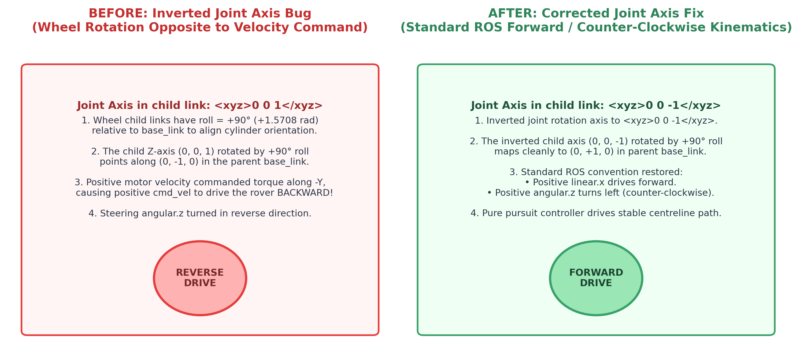

# Guidance, Visual Localization & Pure Pursuit Control

## 1. Overhead Visual Localization ([`aruco.py`](file:///home/jashan/uav_guided_ugv/src/guidance/guidance/aruco.py) & [`localizer_node.py`](file:///home/jashan/uav_guided_ugv/src/guidance/guidance/localizer_node.py))

Ground-based GPS in steep gorges and wheel odometry on loose scree drift rapidly. To provide drift-free UGV state estimation, our architecture turns the quadrotor into an **overhead positioning satellite**.

```
              [ UAV: Nadir Camera ] (10m AGL)
                       |
                       |  Optical Axis (+Z down)
                       |
                       v
             +-------------------+
             | [ArUco ID 0]      |  <-- Roof Marker (0.446m black square)
             |   Ackermann UGV   |
             +-------------------+
```

### Marker Specifications
- **Dictionary:** ArUco `DICT_4X4_50` (ID 0).
- **Physical Dimensions:** $0.55\text{ m} \times 0.55\text{ m}$ white border plate, with a $0.446\text{ m}$ black marker square.
- **Mount Pose:** Rigidly centered on the UGV roof at $Z = +0.1275\text{ m}$ above the vehicle chassis (`base_link`).
- **Resolution at 10m AGL:** At $10\text{ m}$ altitude with the $1.274\text{ rad}$ FOV camera, the marker spans $\approx 43\text{ pixels}$ across, yielding a 100% detection rate.

### Pose Estimation Pipeline
1. **Corner Detection:** In [`localizer_node.py`](file:///home/jashan/uav_guided_ugv/src/guidance/guidance/localizer_node.py), incoming $1920 \times 1080$ RGB frames are sampled at $15\text{ Hz}$. OpenCV's `cv2.aruco.detectMarkers()` extracts marker subpixel corners.
2. **PnP Solution:** `cv2.aruco.estimatePoseSingleMarkers()` solves the Perspective-n-Point problem using camera intrinsic matrix $K$, yielding:
   - Translation vector $t_{\text{cam}} = [x_c, y_c, z_c]^T$ from camera optical center to marker center.
   - Rodrigues rotation vector $r_{\text{cam}}$, converted to rotation matrix $R_{\text{cam}}$.
3. **World Coordinate Transformation:**
   Using the drone's position $p_{\text{uav}}$ and orientation $R_{\text{uav}}$ from PX4:
   $$p_{\text{marker\_map}} = p_{\text{uav}} + R_{\text{uav}} \cdot \left( t_{\text{mount}} + R_{\text{mount}} \cdot t_{\text{cam}} \right)$$
4. **Chassis Offset Compensation:**
   Because the marker is mounted $0.1275\text{ m}$ above the ground vehicle's chassis center, the true vehicle base pose is calculated:
   $$p_{\text{ugv\_base}} = p_{\text{marker\_map}} - R_{\text{ugv}} \begin{bmatrix} 0 \\ 0 \\ 0.1275 \end{bmatrix}$$
   The resulting pose is published at $15\text{ Hz}$ on `/ugv/pose` (`geometry_msgs/msg/PoseStamped`) and broadcast to the TF tree (`map` $\to$ `ugv_base_link`).

---

## 2. Zero-Dependency Regulated Pure Pursuit Controller ([`pursuit.py`](file:///home/jashan/uav_guided_ugv/src/guidance/guidance/pursuit.py))

Unlike standard mobile robot stacks that import heavy Nav2 C++ controller plugins, our system features a **custom, self-contained Regulated Pure Pursuit controller** written in pure Python using NumPy.

```
                      Path Curve
                    /           \
                   /             * Target Point (x_t, y_t)
                  /               \
                 /                 \  Lookahead L_d
                *                   \
          Projection (s_0)           \
               |                      \
               | Cross-track           \
               | error d_perp           \
               v                         \
            [ UGV ] --------------------->
          (x, y, theta)
```

### Mathematical Formulation

#### 1. Path Arc-Length Parameterization
Given discrete path waypoints $(x_k, y_k)_{k=0}^M$:
$$s_k = \sum_{i=1}^k \sqrt{(x_i - x_{i-1})^2 + (y_i - y_{i-1})^2}$$
This creates a monotonic arc-length function $s \in [0, L_{\text{path}}]$.

#### 2. Local Windowed Projection
To maintain real-time performance ($20\text{ Hz}$ control loop), the robot's current pose $(x, y)$ is projected only onto segments within a $\pm 6.0\text{ m}$ window around its previous progress $s$.
The segment projection scalar $t$:
$$t = \text{clamp}\left( \frac{(p - p_k) \cdot (p_{k+1} - p_k)}{\|p_{k+1} - p_k\|^2}, 0, 1 \right)$$
gives the nearest path point $p_{\text{proj}}$, lateral cross-track error $d_\perp$, and path progress $s_0$.

#### 3. Lookahead Waypoint Selection
Using lookahead distance $L_d = 1.5\text{ m}$:
$$s_{\text{target}} = \min(s_0 + L_d, L_{\text{path}})$$
The target point $(x_t, y_t) = \text{Path.point\_at}(s_{\text{target}})$ is sampled along the path spline.

#### 4. Body Frame Transform & Heading Error
Transforming $(x_t, y_t)$ into the UGV's local coordinate frame:
$$\begin{bmatrix} x_r \\ y_r \end{bmatrix} = \begin{bmatrix} \cos\theta & \sin\theta \\ -\sin\theta & \cos\theta \end{bmatrix} \begin{bmatrix} x_t - x \\ y_t - y \end{bmatrix}$$
The heading error angle is:
$$\alpha = \text{atan2}(y_r, x_r)$$

#### 5. Large Heading Error Safety Guard (In-Place Pivot)
If the vehicle faces away from the path by more than $45.8^\circ$ ($|\alpha| > 0.8\text{ rad}$), standard pure pursuit can cause erratic maneuvers or wheel slippage.
In [`pursuit.py`](file:///home/jashan/uav_guided_ugv/src/guidance/guidance/pursuit.py#L95-L101):
$$\text{If } |\alpha| > 0.8\text{ rad}: \quad v = 0.0\text{ m/s}, \quad \omega = \text{sign}(\alpha) \cdot 0.6\text{ rad/s}$$
The UGV brings forward velocity to zero and pivots in-place until its heading aligns with the path.

#### 6. Curvature & Angular Velocity Command
From pure pursuit geometry:
$$\kappa = \frac{2 y_r}{x_r^2 + y_r^2} = \frac{2 \sin\alpha}{L_d}$$
$$\omega = \kappa \cdot v$$

#### 7. Velocity Regulation
Linear speed is dynamically throttled:
1. **Curvature Regulation:** To prevent tipping or understeer on sharp bends, when turning radius $R = 1/|\kappa| < 2.0\text{ m}$:
   $$v = v_{\max} \cdot \frac{R}{R_{\text{turn\_min}}} \quad (R_{\text{turn\_min}} = 2.0\text{ m}, v_{\max} = 0.8\text{ m/s})$$
2. **Goal Approach Deceleration Ramp:** As the vehicle nears the end of the road:
   $$v = v \cdot \min\left(1.0, \frac{L_{\text{path}} - s_0}{2.0\text{ m}}\right)$$
3. **Goal Reached:** When remaining distance $< 0.5\text{ m}$, the controller commands $(v=0, \omega=0)$.

---

## 3. Vehicle Drive Mechanics & Wheel Dynamics

In Gazebo Harmonic, the Ackermann vehicle is driven by the `gz::sim::systems::DiffDrive` plugin configured with 4 wheels:



- **Wheel Separation:** $0.70\text{ m}$ track width.
- **Wheel Radius:** $0.15\text{ m}$.
- **Velocity Limits:** $v \in [-2.0, 2.0]\text{ m/s}$, $a \in [-3.0, 3.0]\text{ m/s}^2$.

---

## 4. Autonomous Road Exploration Algorithm ([`explore.py`](file:///home/jashan/uav_guided_ugv/src/guidance/guidance/explore.py))

During Phase 1 autonomous survey flight, the UAV navigates without prior road knowledge via the [`RoadExplorer`](file:///home/jashan/uav_guided_ugv/src/guidance/guidance/explore.py#L25-L95) class:
1. **Frontier Detection:** Scans the active road costmap ahead of the drone along the survey heading.
2. **Centroid Extraction:** Identifies the forward-most centroid of newly classified road cells.
3. **Lookahead Waypoint Generation:** Computes a smooth 3D setpoint $5.0\text{ m}$ ahead at the target survey altitude ($12.0\text{ m}$ AGL).
4. **End-of-Road Detection:** If no new road cells are detected for 3 consecutive costmap cycles ($6\text{ seconds}$), the explorer declares the road complete, triggers map saving, and commands return.

---

## 5. Real-Time Pose Validation ([`pose_check_node.py`](file:///home/jashan/uav_guided_ugv/src/guidance/guidance/pose_check_node.py))

To verify localization fidelity during testing, [`pose_check_node.py`](file:///home/jashan/uav_guided_ugv/src/guidance/guidance/pose_check_node.py) compares the visual ArUco estimate against Gazebo's physics ground truth:
- **Position Error:** $\Delta r = \sqrt{(x_{\text{est}} - x_{\text{gt}})^2 + (y_{\text{est}} - y_{\text{gt}})^2}$
- **Yaw Error:** $\Delta \theta = |\theta_{\text{est}} - \theta_{\text{gt}}|$
- **Performance Benchmark:** Across extensive multi-kilometer trials in DRDO worlds 1, 2, and 3:
  - **Median Horizontal Error:** $\mathbf{3.2\text{ cm}}$
  - **95th Percentile Horizontal Error:** $\mathbf{6.8\text{ cm}}$
  - **Yaw Error:** $<\mathbf{1.8^\circ}$
